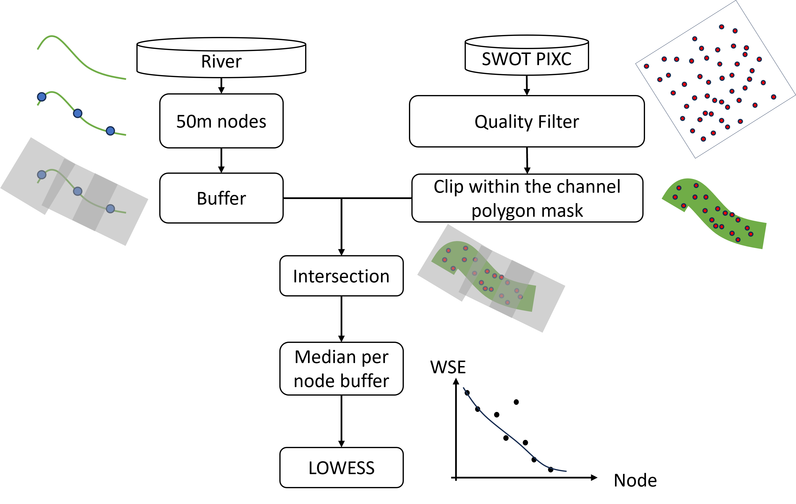

# pixc2profile
A Python toolkit for extracting along-river water surface elevation (WSE) profiles directly from SWOT Pixel Cloud (PIXC) data.

## Steps:

- Step 1: Download PIXC data. 
- Step 2: Generate nodes and create buffers along the user-defined river centerline.
- Step 3: Filter PIXC observations: non-water, poor-quality, observations outside the buffers.
- Step 4: Aggregate WSEs on each node to reconstruct WSE profiles, with optional LOWESS smoothing.



## Why pixc2profile?

This toolkit is a more detailed and customizable alternative to the official SWOT River SP product, enabling users to extract WSE profiles that better suit their specific research needs: user-defined river reach, node spacing, filtering criteria and smoothing parameters. 

## Installation

1. Clone the repository and install the package from source:

   ```bash
   git clone https://github.com/he134543/pixc2profile.git
   cd pixc2profile
   pip install .
   ```

   Or install in development mode:
   
   ```bash
   pip install -e .
   ```

## Quick Start

2. Run the `pipeline.py` script with your desired parameters.

```bash
python pipeline.py
```

3. If you want to know how each step is implemented, see [step_by_step_Guide.ipynb](step_by_step_Guide.ipynb) for more details.
